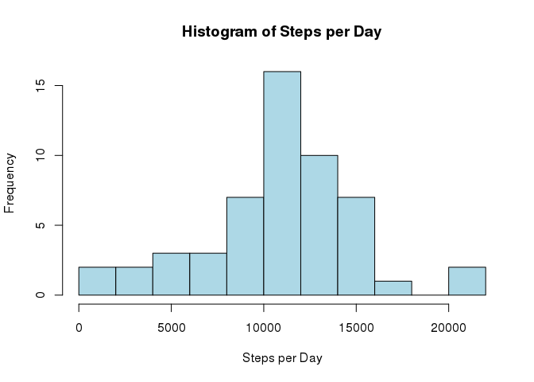
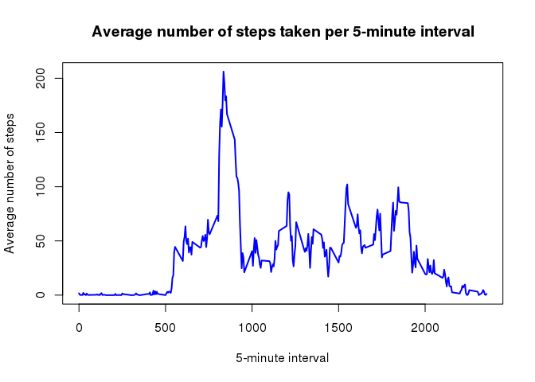
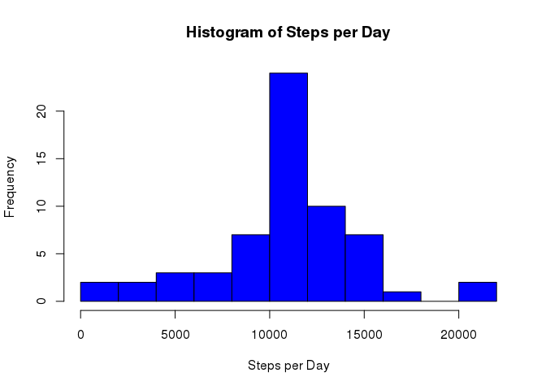
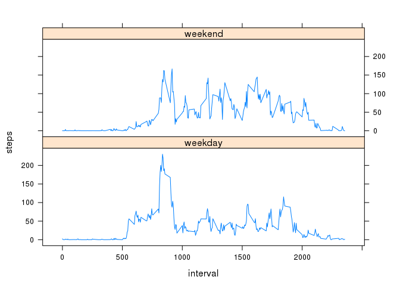

# Reproducible Research: Peer Assessment 1

## Loading and preprocessing the data

Load the dataset specifying the class for the columns


```r
activityData <- read.csv("activity.csv", header = TRUE, colClasses = c("integer", "Date", "integer"))
```

## What is mean total number of steps taken per day?
### Calculate the total number of steps taken per day

```r
stepsPerDay <- aggregate(steps ~ date, activityData, sum)
```

### Make a histogram of the total number of steps taken each day

```r
hist(stepsPerDay$steps, main = "Histogram of Steps per Day", xlab = "Steps per Day", col = "lightblue", breaks = 10)
```



### Calculate and report the mean and median of the total number of steps taken per day

```r
meanSteps <- mean(stepsPerDay$steps, na.rm = TRUE)
medianSteps <- median(stepsPerDay$steps, na.rm = TRUE)
```

Mean of the total number of steps taken pery day: **10766.19**
Median of the total number of steps taken pery day: **10765**

## What is the average daily activity pattern?
### Make a time series plot (i.e. type = "l") of the 5-minute interval (x-axis) and the average number of steps taken, averaged across all days (y-axis)

```r
avgStepsPerInterval <- aggregate(steps ~ interval, activityData, mean, na.rm = TRUE)

plot(x = avgStepsPerInterval$interval, y = avgStepsPerInterval$steps, 
     type = "l", main = "Average number of steps taken per 5-minute interval", 
     xlab = "5-minute interval", ylab = "Average number of steps", col = "blue", lwd = 2)
```



### Which 5-minute interval, on average across all the days in the dataset, contains the maximum number of steps?

```r
maxAvgSteps <- which.max(avgStepsPerInterval$steps)
maxInterval <- avgStepsPerInterval[maxAvgSteps,]$interval
```
5-minute interval containing the maximum number of steps: **835**

## Imputing missing values
### Calculate and report the total number of missing values in the dataset

```r
totalNA <- sum(is.na(activityData))
```

Total number of missing values: **2304**

### Devise a strategy for filling in all of the missing values in the dataset
Use the mean for that 5-minute interval rounded to the nearest integer
newData is a dataset equal to the original dataset but with the missing values filled in

```r
newData <- activityData
naIndex <- which(is.na(newData))
for (i in naIndex) {
  newData[i,]$steps <- round(avgStepsPerInterval[(avgStepsPerInterval$interval == newData[i,]$interval),]$steps)
}
```

### Make a histogram of the total number of steps taken each day and calculate and report the mean and median total number of steps taken per day

```r
stepsPerDay <- aggregate(steps ~ date, newData, sum)
hist(stepsPerDay$steps, main = "Histogram of Steps per Day", xlab = "Steps per Day", col = "blue", breaks = 10)
```



```r
meanSteps2 <- mean(stepsPerDay$steps, na.rm = TRUE)
medianSteps2 <- median(stepsPerDay$steps, na.rm = TRUE)
```

### Do these values differ from the estimates from the first part of the assignment?
Original mean: **10766.19**
Mean after imputing missing data: **10765.64**
Original median: **10765**
Median after imputing missing data: **10762**

### What is the impact of imputing missing data on the estimates of the total daily number of steps?
Both the mean and the median slightly decrease

## Are there differences in activity patterns between weekdays and weekends?
### Create a new factor variable in the dataset with two levels – “weekday” and “weekend” indicating whether a given date is a weekday or weekend day

```r
newData$day <- as.factor(ifelse(weekdays(newData$date) %in% c("Saturday", "Sunday"), "weekend", "weekday"))
```

### Make a panel plot containing a time series plot (i.e. type = "l") of the 5-minute interval (x-axis) and the average number of steps taken, averaged across all weekday days or weekend days (y-axis)

```r
library(lattice)
avgSteps <- aggregate(steps ~ interval + day, newData, mean)
xyplot(steps ~ interval | day, data = avgSteps, type = "l", layout = c(1, 2))
```


